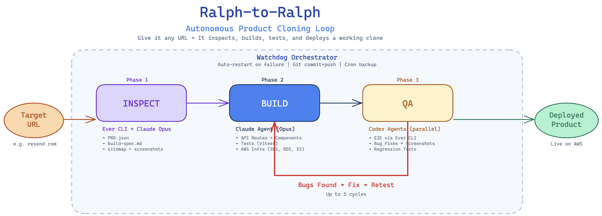

# Ralph-to-Ralph

**Autonomous Product Cloning Loop**

> **Want to clone your own SaaS?** Use the template repo: [namuh-eng/ralph-to-ralph](https://github.com/namuh-eng/ralph-to-ralph/tree/main)

Give it any URL → It inspects, builds, tests, and deploys a working clone.

**Stop paying for SaaS. Clone it.** Resend took $21M and years. Ralph did it in an afternoon.



## 5 Hours. Zero Human Code. Deployed to AWS.

At Ralphthon Seoul 2026, we hit start and **walked away from our computers**. For 5 hours straight, Ralph-to-Ralph ran completely autonomously — inspecting [resend.com](https://resend.com), generating its own PRD and build spec, writing the full stack, running tests, and deploying to AWS. **We did not write a single line of code.** The loops did everything: 184K lines of code generated across 102 autonomous commits.

After the loops finished, we spent **1 additional hour of manual debugging** to polish edge cases — the only human intervention in the entire build.

**Result:** A fully working Resend clone, live in production on AWS, built and deployed by AI agents alone.

> **2nd Place Winner** — Ralphthon Seoul 2026

---

### Powered by [Ever](https://foreverbrowsing.com) — Our Browser Agent

The first phase of every Ralph-to-Ralph loop is powered by **Ever**, our browser agent built as a Chrome extension, along with **Ever CLI** — a command-line tool we created for autonomous website inspection. Ever navigates, screenshots, and deeply inspects any website — its docs, API reference, sitemap, and every interactive element. **Ever is our moat** — without it, the Inspect loop can't run.

**[Try Ever → foreverbrowsing.com](https://foreverbrowsing.com)**

---

## What Is This?

Ralph-to-Ralph clones real products end-to-end — from browser analysis to deployed production software. Real, working products that you now own.

**The problem:** Non-technical founders know exactly what product they want to build or clone, but can't build and launch it at production quality themselves. Getting to production typically takes months or years, requires entire engineering teams, and costs significant money.

**The solution:** Ralph-to-Ralph automates the entire process. Point it at any SaaS product URL and it autonomously inspects, plans, builds, tests, and deploys a fully working clone. The loop IS the product — all you need is our harness.

## How It Works

Ralph-to-Ralph runs a three-phase autonomous pipeline:

### Phase 1: Inspect (Ralph Loop #1)

**Ever CLI + Claude Opus** analyzes the target URL and produces:
- `PRD.json` — structured product requirements
- `build-spec.md` — technical build specification
- Sitemap + screenshots of every page

### Phase 2: Build (Ralph Loop #2)

**Claude Agent (Opus)** builds the full stack:
- API routes + React components
- Unit tests (Vitest)
- AWS infrastructure (SES, RDS, S3)

### Phase 3: QA (Ralph Loop #3)

**Codex Agents (parallel)** verify everything works:
- E2E testing via Ever CLI
- Bug fixes + visual regression screenshots
- Regression test suite

A **bug fix loop** (Bug Found → Fix → Retest, up to 5 cycles) runs between Build and QA until the product passes all checks.

## Watchdog Orchestrator

A strict watchdog wraps the entire pipeline, ensuring all Ralph loops stay stable and keep shipping:

- **Auto-restart on failure** — if any loop crashes, it restarts automatically
- **Git commit + push** — every milestone is committed and pushed
- **Cron backup** — periodic backups for safety

## AI Agents & Tools

| Agent | Role |
|-------|------|
| **[Ever CLI](https://foreverbrowsing.com)** | Custom browser agent for site inspection and E2E testing |
| **Claude Opus** | Powers the Inspect and Build loops — architecture, code generation, infra setup |
| **Codex** | Runs parallel QA agents for fast, thorough verification |

## Demo Results: Resend.com Clone

We ran Ralph-to-Ralph against [resend.com](https://resend.com) — an email API platform for developers.


*The autonomously-built Resend clone dashboard running on AWS App Runner — full email sending/receiving, domains, API keys, broadcasts, templates, webhooks, and more.*

### Video Demo — Sending a Real Email

**Live deployed clone:** deploy your own with `bash scripts/deploy.sh`

### By the Numbers

| Metric | Value |
|--------|-------|
| Total autonomous runtime | **5 hours** (hands-off) |
| Manual debugging after | **1 hour** |
| Lines of code generated | **184,000+** |
| Autonomous commits | **102** |
| Features built | 52 |
| Unit tests | 388 passing |
| Test files | 35 |
| Dashboard pages | 10 |
| API endpoints | 16+ |
| Human code written | **0 lines** |

### What Actually Works

- **Real email sending** — Send emails via REST API or TypeScript SDK. Emails arrive in your inbox via AWS SES (production mode, not sandbox)
- **React email templates** — SDK supports `react` prop with `renderToStaticMarkup()`. Write emails as React components
- **Domain verification** — Add a domain, DNS records (DKIM/SPF/DMARC) auto-configured via Cloudflare API, SES verifies
- **API key management** — Create, list, delete API keys with permission levels (full access / sending only)
- **Full dashboard** — 10 pages matching Resend's UI: Emails, Domains, API Keys, Broadcasts, Templates, Audience, Webhooks, Metrics, Logs, Settings
- **Broadcast editor** — Block-based rich text editor with slash commands, styling sidebar, review panel
- **Template editor** — Create, edit, publish templates with variable substitution
- **Contact management** — CRUD contacts with segments, topics, properties
- **Webhooks** — Register endpoints, select from 17 event types across 3 categories
- **API docs page** — Auto-generated endpoint documentation at `/docs`
- **Auth wall** — API key unlocks both dashboard and API access
- **Deployed to AWS** — App Runner with RDS Postgres, real cloud infrastructure

#### Real Emails, Received in Gmail

| Welcome Email | Broadcast Notification |
|:---:|:---:|
|  |  |

| API Key Rotated | TLS Enforced |
|:---:|:---:|
|  |  |

*All emails sent from the autonomously-built clone via AWS SES — received in a real Gmail inbox.*

### Send an Email (Try It)

```bash
curl -X POST https://YOUR_APP_RUNNER_URL/api/emails \
  -H "Authorization: Bearer YOUR_API_KEY" \
  -H "Content-Type: application/json" \
  -d '{"from":"hello@yourdomain.com","to":["your@email.com"],"subject":"Hello!","html":"<h1>It works!</h1>"}'
```

Or with the TypeScript SDK:

```typescript
import { ResendClone } from "resend-clone";

const resend = new ResendClone("YOUR_API_KEY", {
  baseUrl: "https://YOUR_APP_RUNNER_URL",
});

await resend.emails.send({
  from: "hello@yourdomain.com",
  to: "your@email.com",
  subject: "Built by AI",
  react: <WelcomeEmail name="World" />,
});

## Tech Stack

- **Framework:** Next.js 16 (App Router, Turbopack)
- **Language:** TypeScript (strict mode)
- **Styling:** Tailwind CSS
- **UI:** Radix UI
- **Database:** RDS Postgres via Drizzle ORM
- **Email:** AWS SES
- **Storage:** AWS S3
- **Deployment:** AWS App Runner

## Team

- **Jaeyun Ha** — [github.com/jaeyunha](https://github.com/jaeyunha)
- **Ashley Ha** — [github.com/ashley-ha](https://github.com/ashley-ha)

## Presentation

[View the pitch deck (PDF)](ralph-to-ralph.pdf)

## Ralphthon Seoul 2026

This project was built for [Ralphthon Seoul 2026](https://ralphthon.com) — a hackathon focused on building real products with AI agents.
